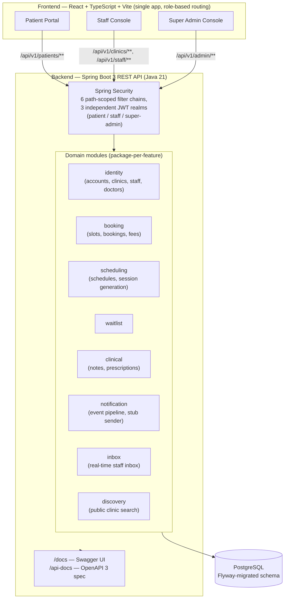

# CMS2 — Clinic Management System

A multi-tenant clinic management system: patients book and manage appointments, clinic staff run daily operations (scheduling, queues, walk-ins, cancellations, clinical documentation), and a Super Admin layer verifies clinics and doctors before they go live.

Three roles share one system:
- **Patients** — book appointments, join queues/waitlists, track bookings.
- **Clinic staff** (ClinicAdmin, Doctor, Operations) — scheduling, bookings/walk-ins, queue management, cancellations, consultation notes/prescriptions, a real-time inbox.
- **Super Admin** — verifies clinics and doctor licenses, triggers session generation.

## Architecture



Each domain module owns its own controllers, services, repositories, and exception handling; cross-module effects (e.g. cancellation → waitlist offer, booking → notification event) go through explicit events, not direct reach-through. See [`.specify/memory/constitution.md`](.specify/memory/constitution.md) for the project's architectural principles, and [`PRODUCT.md`](PRODUCT.md) for product/design context.

## Tech stack

| | |
|---|---|
| **Backend** | Java 21, Spring Boot 3.3, Spring Security (JWT), Spring Data JPA, Flyway, PostgreSQL, Gradle |
| **Frontend** | React 18, TypeScript, Vite, Tailwind CSS 4, React Router |
| **Testing** | JUnit 5 + Mockito + AssertJ + Testcontainers (backend), Vitest + Testing Library (frontend) |
| **API docs** | springdoc-openapi (Swagger UI) |
| **CI** | GitHub Actions ([`.github/workflows/ci.yml`](.github/workflows/ci.yml)) |

## Prerequisites

- **Java 21** (a Gradle wrapper is included — no separate Gradle install needed)
- **Node.js 20+** and npm
- **PostgreSQL 16+**, running locally and reachable (this project does not containerize the database — bring your own local instance)
- **bash** (Git Bash on Windows works fine) to run `dev.sh`

## Quickstart

1. **Create a local database** matching the defaults in [`.env.example`](.env.example) (skip this step if you already have a `cms` database/user, or if you've set different values in your own `.env`):
   ```bash
   psql -U postgres -c "CREATE DATABASE cms;"
   psql -U postgres -c "CREATE USER cms WITH PASSWORD 'cms';"
   psql -U postgres -c "GRANT ALL PRIVILEGES ON DATABASE cms TO cms;"
   ```
2. **Clone the repo and start everything** — this one script copies `.env.example` → `.env` on first run (review it, especially the `DB_*` values, if your Postgres setup differs), installs frontend dependencies, and starts both the backend and frontend together. Backend schema migrations (Flyway) run automatically on startup — there's no separate migrate step.
   ```bash
   ./dev.sh
   ```
3. **Open the app:**
   - Frontend: <http://localhost:5173>
   - Interactive API docs (Swagger UI): <http://localhost:8080/docs>
   - Raw OpenAPI 3 spec: <http://localhost:8080/api-docs>

`./dev.sh backend` or `./dev.sh frontend` starts just one side, if you only need one running. Ctrl+C stops whatever `./dev.sh` started.

### Windows without Git Bash / bash

Run the two halves in separate terminals — PowerShell:
```powershell
copy .env.example .env   # first run only; review DB_* values
cd backend; .\gradlew bootRun
```
```powershell
cd frontend; npm install; npm run dev
```

## Environment variables

All variables are documented with dummy/default values in [`.env.example`](.env.example) — copy it to `.env` and adjust as needed (`dev.sh` does this automatically on first run). Highlights:

| Variable | Default | Purpose |
|---|---|---|
| `DB_URL`, `DB_USERNAME`, `DB_PASSWORD` | `jdbc:postgresql://localhost:5432/cms`, `cms`, `cms` | Backend database connection |
| `PORT` | `8080` | Backend HTTP port |
| `APP_CORS_ALLOWED_ORIGINS` | `http://localhost:5173` | Origins allowed to call the API from a browser |
| `PATIENT_JWT_SECRET`, `STAFF_JWT_SECRET`, `SUPER_ADMIN_JWT_SECRET` | *(unset)* | JWT signing keys, one per identity realm. **Deliberately no default** — unset means a random key is generated at startup (safe for local dev; every restart invalidates existing tokens; set these to a stable value for a working session) |
| `SUPER_ADMIN_USERNAME`, `SUPER_ADMIN_PASSWORD` | *(unset)* | Same fail-safe pattern — unset generates a random Super Admin credential, logged at startup |
| `RATE_LIMIT_MAX_ATTEMPTS`, `RATE_LIMIT_WINDOW_SECONDS` | `30`, `60` | Per-IP throttle on login/signup/registration endpoints |
| `VITE_API_BASE_URL` | `http://localhost:8080` | Frontend's backend API base URL |

## API documentation

The backend serves interactive, auto-generated OpenAPI 3 docs from the running application — no separate doc-build step, so they can never drift from the actual code:

- **Swagger UI**: `http://localhost:8080/docs`
- **Raw spec (JSON)**: `http://localhost:8080/api-docs`

Two endpoints ([`POST /api/v1/staff/login`](backend/src/main/java/com/cms/identity/account/StaffAuthController.java) and [`POST /api/v1/patients/signup`](backend/src/main/java/com/cms/patient/api/PatientAccountController.java)) are annotated in full as worked examples — request/response schemas plus every success and failure status code the endpoint actually returns.

## Project structure

```
backend/    Spring Boot API (Gradle) — src/main/java/com/cms/<module>, Flyway migrations in src/main/resources/db/migration
frontend/   React + Vite SPA — src/features/<domain>, src/routes/<role>
specs/      spec-kit design artifacts (spec/plan/tasks) for implemented features
backlog/    The full feature backlog this project was built from, in dependency-resolved build order
.specify/   spec-kit configuration and the project constitution
```

## Testing

```bash
cd backend && ./gradlew test    # unit + integration (Testcontainers spins up real Postgres — needs Docker)
cd frontend && npm run test     # Vitest
```

See [`CONTRIBUTING.md`](CONTRIBUTING.md) for the full testing/linting workflow and branching conventions.

## License

[MIT](LICENSE)
